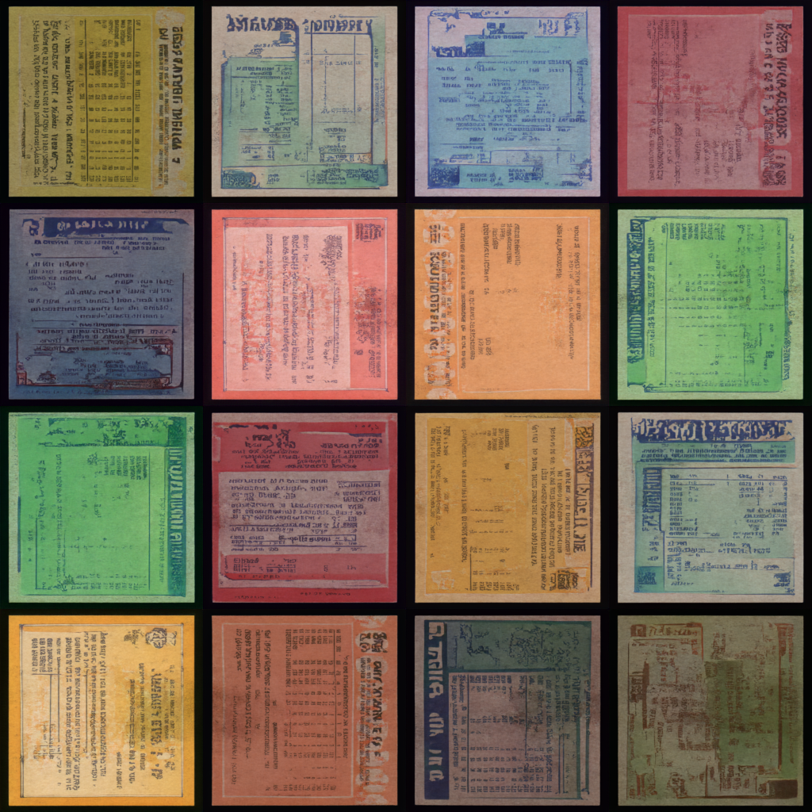
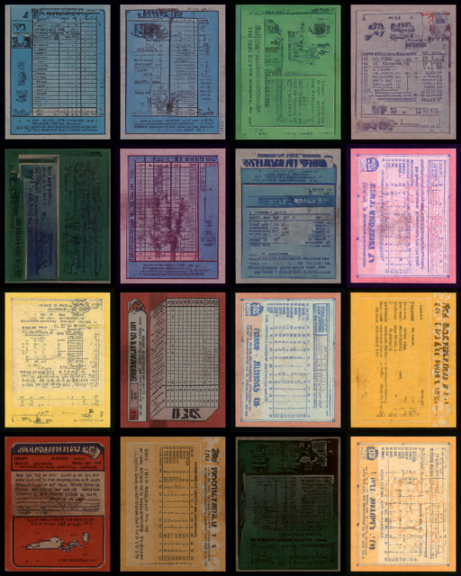
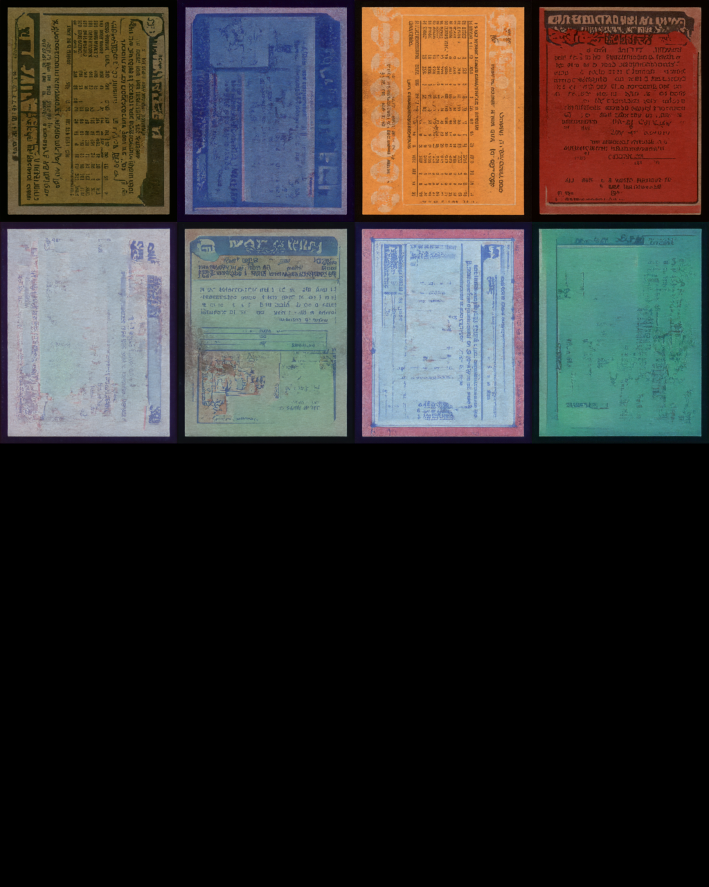
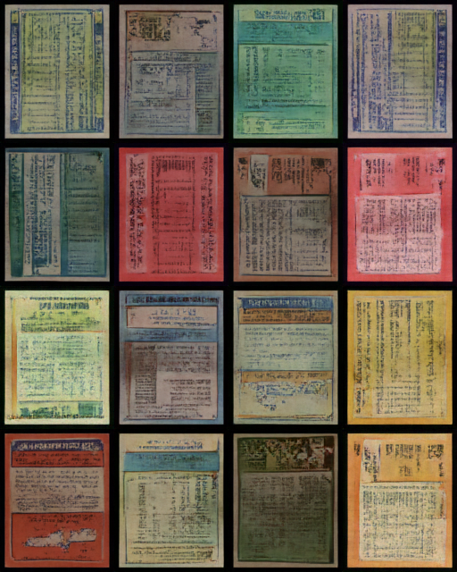
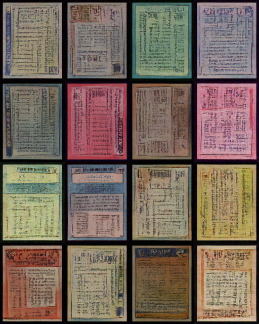

# Synthetic Card Generator

## How to run the code

1. Install Python. I used version 11.9
2. Create a virtual env: `python3 -m venv .venv`
3. In terminal activate the virtual env: `source .venv/Scripts/activate` or follow how to do this on your operating system. I am on windows.
4. In the same terminal run the following command: `pip3 install ipykernel ipywidgets matplotlib accelerate`
5. Follow the steps on the [pytorch](https://pytorch.org/get-started/locally/) website to install additional libraries like torchvision and to use CUDA if available on your device.
6. Open the _diffusion_model_training.ipynb_ jupyter notebook
7. If you are using vscode, click select kernel on the upper right corner, select python environments and then the name of the virtual environment you created which should be .venv
8. Run the first cell to install libraries required for the notebook.
9. Run the second cell to login to hugging face to upload the model once it is done training
10. Configure the fourth cell with your desired hyperparameters. You will also configure your hugging face repository name here. (Make sure the repository is created and it is public.)
11. Continue to run the rest of the cells to follow the tutorial on how to train a diffusion model but now using data from the ./dataset directory.
    - Note: The dataset directory only has a sample of the type of gum stain cards I have been working with in my capstone. I cannot provide all the data.

## Train a Diffusion Model

Using the Hugging Face [Train a diffusion model tutorial](https://huggingface.co/docs/diffusers/en/tutorials/basic_training) and [noteboook](https://colab.research.google.com/github/huggingface/notebooks/blob/main/diffusers/training_example.ipynb), I was able to train a UNet model to generate cards.

I trained the following models using the same script but with different sample data and other hyperparameter changes:

1. [cards](https://huggingface.co/megamp15/cards) - This is the first attempt at using the tutorial notebook on the data. I only changed the number of epochs to 100 epochs.
   - The 99th epoch was saved and it created suprisingly good looking cards although they were square in shape due to the script's preprocessing of the input images into 128 x 128 squares.
   - 
2. [all_gum_stain_cards](https://huggingface.co/megamp15/all_gum_stain_cards) - This was my second attempt where I changed the sample size to reflect the aspect ratio of the initial cards. The new dimensions are 160 x 128. I also trained this for 200 epochs.
   - The 199th epoch below shows the great quality of the cards. You can also see that a few of the cards did have very realistic gum stains.
   - 
3. [higher_res_gum_stain_cards](https://huggingface.co/megamp15/higher_res_gum_stain_cards) - This was my third attempt where I tried to increase the dimensions of the images to provide a more higher quality synthetic card generator for use in our models.
   - With the dimensions now at 320 x 256 the cards have much better resolution. The problem arises with hardware requirements where approximately doubling the resolution causes CUDA problems and almost 4-6x times longer to train. I only was able to do 100 epochs and that took almost 24 hours to run. I wanted to see what card dimensions I could run on my own physical hardware without using any cloud based training.
   - You are still able to see gum stains being created so if I was able to run this for 200 epochs or more I do believe that we would see cards like in all_gum_stain-cards but at a higher image quality.
   - 
4. I then tested two different specific categories I had found when annotating these gum stain cards by hand: Full and White/Marks. These were both trained on the lower 160 x 128 resolution for 150 epochs due to hardware and time constraints. I was having issues with the GPU cache not emptying.
   1. [FULL_GUM_STAIN_CARDS](https://huggingface.co/megamp15/FULL_GUM_STAIN_CARDS)
      - Full means that the gum stain was across a majority of the card and I would have to use one big bounding box
      - In the 149th epoch samples generated by the model I was able to get more cards with clearer gum stains.
        - 
   2. [WHITE_OR_MARKS_GUM_STAIN_CARDS](https://huggingface.co/megamp15/WHITE_OR_MARKS_GUM_STAIN_CARDS)
      - White/Marks was gum stain cards that had any sort of gum stain white or other color residue remaining.
      - In the 149th epoch samples generated by this model, I was not able to see the white marks. I believe this is due to the nature of the cards having more bigger black gum stains along with the smaller white marks so due to the nature of the data it could not extract those features in the 150 epochs.
        - 

## Generate Cards

Use the uploaded diffusion models on hugging face to generate cards using the _card_image_gen.ipynb_.

### How to run:

1. If you are using VS Code, select the kernel as seen in step 7 in the earlier How to run the code section above.
2. Run the first cell to install any packages that may be missing
3. Run the rest of the cells one by one:
   1. Choose one of the following models you want to run by changing the `model` variable in the fourth cell:
      - [cards](https://huggingface.co/megamp15/cards)
      - [all_gum_stain_cards](https://huggingface.co/megamp15/all_gum_stain_cards)
      - [higher_res_gum_stain_cards](https://huggingface.co/megamp15/higher_res_gum_stain_cards)
      - [FULL_GUM_STAIN_CARDS](https://huggingface.co/megamp15/FULL_GUM_STAIN_CARDS)
      - [WHITE_OR_MARKS_GUM_STAIN_CARDS](https://huggingface.co/megamp15/WHITE_OR_MARKS_GUM_STAIN_CARDS)
   2. Run the fifth cell. This will pull down the model from hugging face and use the trained diffusion model to generate a card.
      - The images are generated and saved to the _./generated_cards/_ directory.
      - Here are some examples for each of the models:
        - [cards](https://huggingface.co/megamp15/cards)
          - 
        - [all_gum_stain_cards](https://huggingface.co/megamp15/all_gum_stain_cards/blob/main/samples/0199.png)
          - 
        - [higher_res_gum_stain_cards](https://huggingface.co/megamp15/higher_res_gum_stain_cards)
          - 
        - [FULL_GUM_STAIN_CARDS](https://huggingface.co/megamp15/FULL_GUM_STAIN_CARDS)
          - 
        - [WHITE_OR_MARKS_GUM_STAIN_CARDS](https://huggingface.co/megamp15/WHITE_OR_MARKS_GUM_STAIN_CARDS)
          - 
      - The saved images are outputed to the _generated_cards/_ directory.
